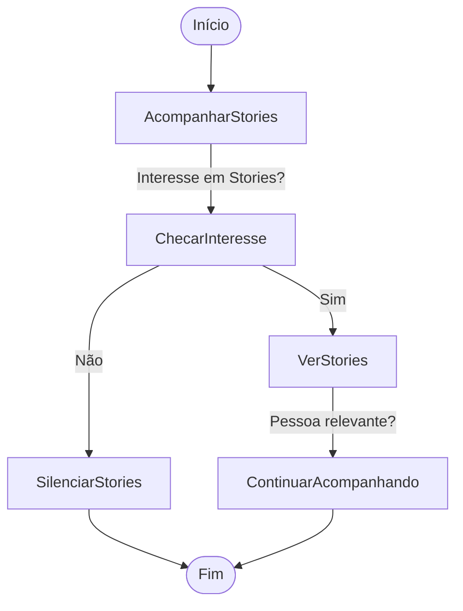
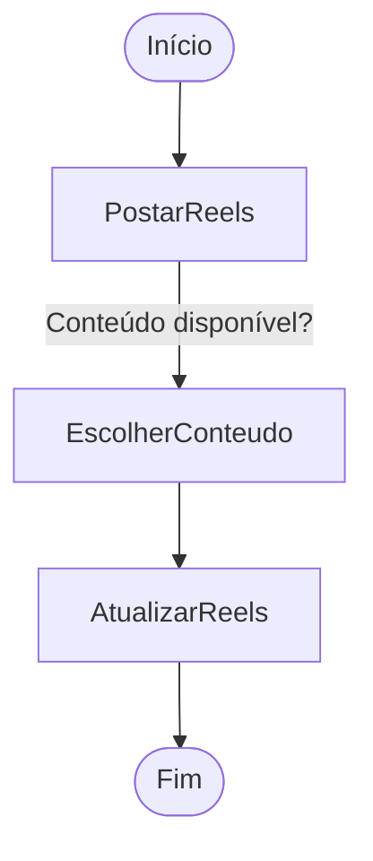
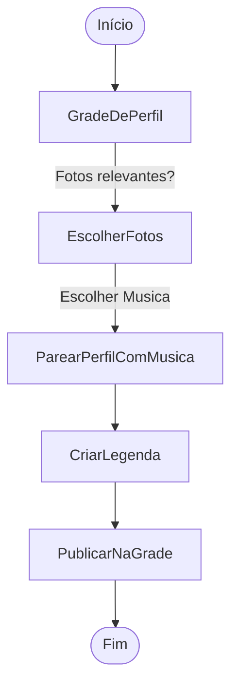

# Diário de Uso de Ferramentas

Dado que estou sem nada de interessante para fazer, e não vou projetar de graça os softwares que ajudariam a empresa onde trabalho no rastreio interno, decidi que vou começar a estudar padrões de usos para as ferramentas do meu dia a dia, começando com o Insta, segue o fluxograma com nomes autoexplicativos.

---

## **1. Fluxo de Uso de Stories**  
O objetivo é saber quem tem interesse em mim, e demonstrar interesse em quem acho interessante, e caso perceba ruido, ou até carencia para saber como esta a vida de uma pessoa toxica, silencio.

---

## **2. Fluxo de Postagem de Reels**  
Aqui é mais para recicliar o conteudo que consumi no Reddit e salvei. Quero deixar como repositório para extender minha representação na rede, como se fosse uma extenção minha, onde cada post que vi guardo num banco de dados brutos(memes), Relevantes eu reposto como Stories e deixo em destaque e meu cerebro junto com o algortimo do Instagram atua para processar e otimizar o alcance da minha pagina e influencia, onde eu organizo meu estado atual, espehando minha pagina com que sou e o algoritmo me conecta com pessoas semelhantes.

Considere conteudo também ideias e estados mentais verbalizado.

---

## **3. Fluxo de Atualização da Grade de Perfil**  
O objetivo é parear momentos da minha vida com filtros e letras de musicas, que atraves da minha interação com chatbots, irei linkar o que a musica é para mim e meu perfil psicologico, assim aprendo quem eu sou e me reescrevo profundamente a cada foto, aqui sera apenas em condições especificas, pois a carga de estresse é enorme. 

---

### **Objetivo Geral:**  
Minha vida pode ser um caos emocional, mas é justamente por isso que consigo ser logico. A lógica reina aqui, e cada decisão é feita pra balancear meu algoritmo interno de "sou foda, mas nem tanto" com *"só venha se estiver à altura"*.  

Seja você autista, carente, ou só alguém que adora ver uma estratégia funcionando, esse README é sua bíblia.  

👊 *"A emoção é passageira, mas o conteúdo fica pra sempre."*  

Ps: E sim, esse repositório é a prova cabal do meu autismo, preciso de uma namorada kkkkkkkkk
